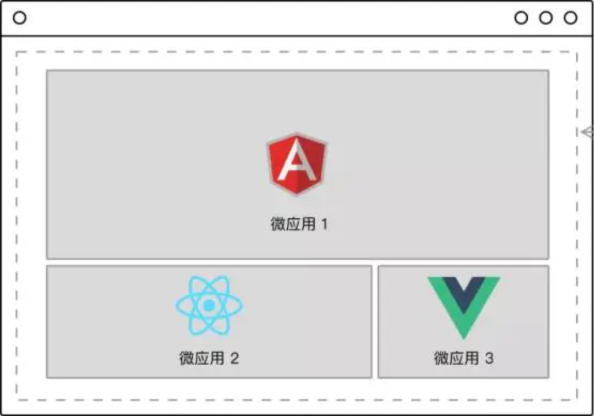

# 微前端

## 介绍

近几年,微服务架构在后端技术社区大红大紫,它被认为是 IT 软件架构的未来技术方向.

我们如何借鉴后端微服务的思想来构建一个现代化前端应用?

一个可以可以落地的前端微服务解决方案.

## 特点

- **独立部署**: 单不对其他模块有任何影响。
- **技术选型灵活**: 在同一项目下可以使用如今市面上所有前端技术栈,也包括未来的前端技术栈。
- **容错**: 单个模块发生错误,不影响全局。
- **扩展**: 每一个服务可以独立横向扩展以满足业务伸缩性，与资源的不必要消耗。

## 何时需要前端微服务化?

- 项目技术栈过于老旧,相关技能的开发人员少,功能扩展吃力,重构成本高,维护成本高.
- 项目过于庞大,代码编译慢,开发体差,需要一种更高维度的解耦方案.
- 单一技术栈无法满足你的业务需求

## 链接

- [可能是你见过最完善的微前端解决方案](https://qiankun.umijs.org/zh)
